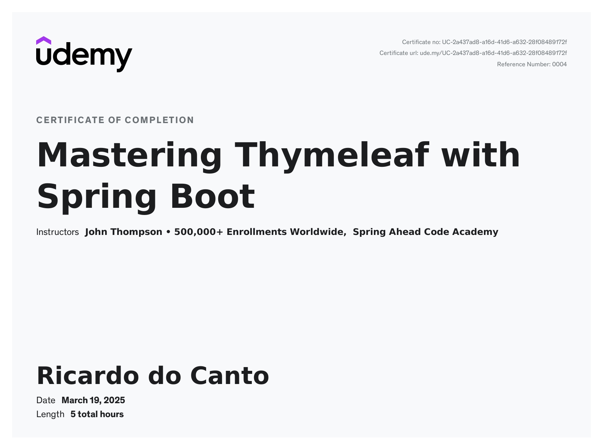

# Mastering Thymeleaf with Spring Boot

The code contained in this folder is written while taking the course
[Mastering Thymeleaf with Spring Boot](https://www.udemy.com/course/mastering-thymeleaf-with-spring/)
which is presented by [John Thompson](https://twitter.com/serge_a_storms).

[Bulma](https://bulma.io/) is used instead [Bootstrap](https://getbootstrap.com/) for the CSS Framework.

## Course Certificate

